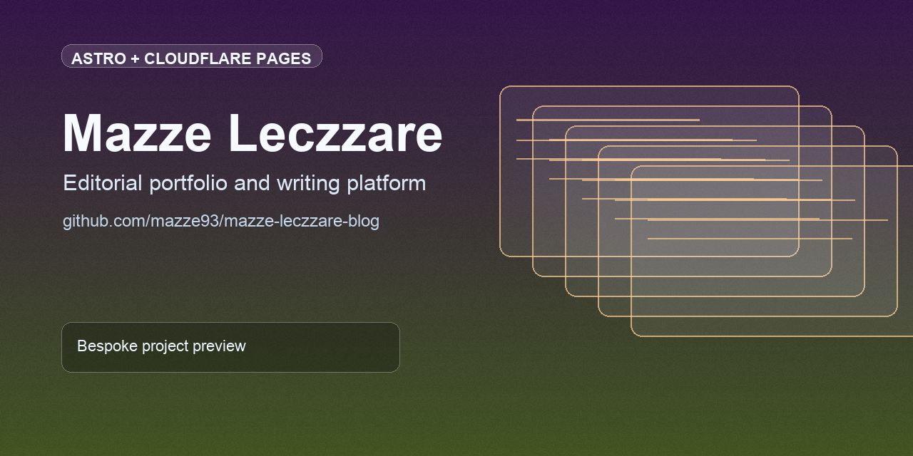

# Mazze Leczzare Blog




Personal editorial platform for essays, project notes, and public-facing narrative around privacy, cognition, and security-forward design.

## At a glance
- Fast, SEO-forward Astro site with clean content workflow.
- Markdown/MDX publishing with lightweight deployment on Cloudflare Pages.
- Designed for expressive long-form writing on web and mobile.

## Quick links
- [Deployment](#deployment)
- [Getting Started](#getting-started)
- [Project Structure](#-project-structure)

## GitHub social preview
Upload `.github/social-preview.png` in repository `Settings -> General -> Social preview` to use the branded card on link shares.

## Deployment

This blog is configured for static deployment to Cloudflare Pages:

1. Connect your GitHub repository to Cloudflare Pages
2. Use the following build settings:
   - **Build command**: `npm run build`
   - **Build output directory**: `dist`
   - **Root directory**: `/` (default)

The site will be automatically deployed on every push to your main branch.

### Contact form delivery

Cloudflare Pages does not support the `send_email` binding directly in a Pages `wrangler.toml`.

To enable the `/contact` form in production, configure one of these delivery paths:

1. Set `CONTACT_WEBHOOK_URL` in Pages environment variables to a webhook or Worker endpoint that accepts the contact payload.
2. Run the contact endpoint in a Worker context that provides a `CONTACT_EMAIL` binding.

Optional variables:

- `CONTACT_TO_EMAIL`
- `CONTACT_FROM_EMAIL`
- `CONTACT_SUBJECT_PREFIX`
- `CONTACT_WEBHOOK_AUTH_HEADER`

## Getting Started

To create a similar blog project with Astro:

```bash
npm create astro@latest -- --template blog
```

Or clone this repository and install dependencies:

```bash
git clone <your-repo-url>
cd mazze-leczzare-blog
npm install
```

## 🚀 Project Structure

Astro looks for `.astro` or `.md` files in the `src/pages/` directory. Each page is exposed as a route based on its file name.

There's nothing special about `src/components/`, but that's where we like to put any Astro/React/Vue/Svelte/Preact components.

The `src/content/` directory contains "collections" of related Markdown and MDX documents. Use `getCollection()` to retrieve posts from `src/content/blog/`, and type-check your frontmatter using an optional schema. See [Astro's Content Collections docs](https://docs.astro.build/en/guides/content-collections/) to learn more.

Any static assets, like images, can be placed in the `public/` directory.

## 🧞 Commands

All commands are run from the root of the project, from a terminal:

| Command                   | Action                                                      |
| :------------------------ | :---------------------------------------------------------- |
| `npm install`             | Installs dependencies                                       |
| `npm run dev`             | Starts local dev server at `localhost:4321`                |
| `npm run build`           | Builds production site to `./dist/`                        |
| `npm run preview`         | Previews your build locally                                 |
| `npm run check`           | Runs production build and TypeScript check                 |
| `npm run docs:check`      | Verifies docs/instruction consistency against repo reality |
| `npm run astro ...`       | Runs Astro CLI commands like `astro add`, `astro check`    |
| `npm run astro -- --help` | Gets help using the Astro CLI                               |

## 👀 Want to learn more?

Check out [our documentation](https://docs.astro.build) or jump into our [Discord server](https://astro.build/chat).

## Credit

This theme is based off of the lovely [Bear Blog](https://github.com/HermanMartinus/bearblog/).
