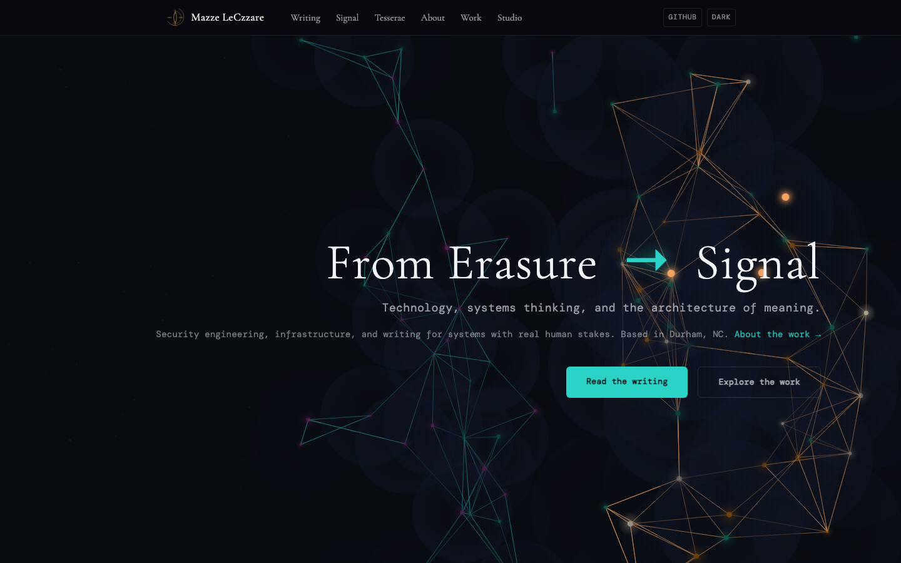

# Mazze LeCzzare — Personal Blog

[](https://github.com/mazze93/mazze-leczzare-blog/actions/workflows/ci.yml)
[](https://github.com/mazze93/mazze-leczzare-blog/actions/workflows/codeql.yml)
[](https://github.com/mazze93/mazze-leczzare-blog/actions/workflows/lighthouse.yml)


Security engineering, technical writing, and essays from Mazze LeCzzare — founder of Secure Pride. Infrastructure and story for systems with real human stakes.

**Live at [mazzeleczzare.com](https://mazzeleczzare.com).** Built privacy-first: no trackers, no analytics scripts, static delivery on Cloudflare Pages.

[](https://mazzeleczzare.com)

## Stack

| Layer | Technology |
| --- | --- |
| Framework | Astro 7 (fully static, `output: "static"`) |
| UI islands | React 19 — interactive components only |
| Content | Markdown + MDX via Astro Content Collections |
| Edge functions | Cloudflare Pages Functions (`functions/api/`) |
| Fonts | Cormorant Garamond, Cormorant SC, DM Mono, DM Sans, Playfair Display via `@fontsource`; Space Grotesk + Crimson Pro on `/cipher-gothic/` only |
| RSS | `@astrojs/rss` — `/rss.xml` |
| Deploy | Cloudflare Pages |

## Commands

```bash
npm install        # Install dependencies
npm run dev        # Dev server → localhost:4321
npm run build      # Static build → dist/
npm run preview    # Preview built site locally
npm run check      # Build + TypeScript check (repo-standard validation)
npm run docs:check # Validate docs/instruction consistency
npm run test       # Unit tests (vitest)
```

## Deployment

Deployed to **Cloudflare Pages** (not Workers, not Vercel).

Build settings:
- **Build command**: `npm run build`
- **Build output directory**: `dist`
- **Root directory**: `/`

### Contact form

The `/contact` form (`functions/api/contact.ts`) uses a webhook delivery path:

1. **Webhook** — set `CONTACT_WEBHOOK_URL` as a Cloudflare secret.
2. Optional: `CONTACT_WEBHOOK_AUTH_HEADER` for an Authorization header expected by the receiver.

Non-secret vars (`CONTACT_FROM_EMAIL`, `CONTACT_SUBJECT_PREFIX`) live in `wrangler.toml` under `[vars]`. Route-level rate limiting for Pages Functions should be managed in the Cloudflare dashboard rather than `wrangler.toml`.

```bash
npx wrangler secret put CONTACT_WEBHOOK_URL
npx wrangler secret put CONTACT_WEBHOOK_AUTH_HEADER
```

## Project Structure

```text
src/
  components/       # Astro + React components
  content/blog/     # Markdown/MDX posts (Content Collection)
  layouts/          # BlogPost.astro, HomepageLayout.astro
  pages/            # File-based routes
    about.astro     # Full custom page — hero, work cards, engagement types
    cipher-gothic.astro  # Cipher Gothic design system documentation
    rss.xml.js      # RSS feed
  styles/           # global.css + homepage.css
  consts.ts         # Site-wide constants (single source of truth)

functions/api/
  contact.ts        # Contact form delivery
  share-event.ts    # Paragraph quote share telemetry

public/
  apple-touch-icon.png  # iOS home screen icon (180×180)
  favicon-32.png        # PNG favicon fallback (32×32)
  bimi-logo.svg         # BIMI email brand mark
scripts/ops/        # Local operational scripts
docs/operations/    # Agent protocol and session memory
```

## Authoring Posts

Create `src/content/blog/your-slug.md` with frontmatter:

```yaml
---
title: "Post Title"
description: "One-sentence description."
pubDate: 2026-04-14
heroImage: ../../assets/images/blog/your-image.jpg   # optional — relative path, processed by Astro
---
```

Post appears at `/blog/your-slug/` and surfaces on the homepage if in the 6 most recent.

## License

Code is [MIT](LICENSE). Prose and images © Mazze LeCzzare, all rights reserved.
